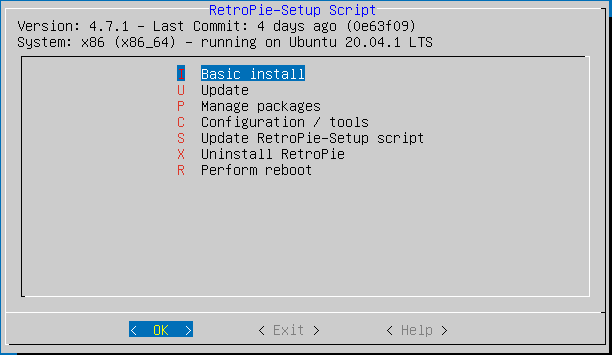

# Retroarch_Mame_JPAC
Cílem je zaznamena a uchovat pro pzdější použití vše co jsem se naučil při konfiguraci emulátoru herního automatu.
## Hardware
- arcade automat libovolné konfigurace. V mém případě to je JAMMA konektor, 2xjoystick, 2x šest tlačítek, P1 Start, P2 Start a jedno tlačítko navíc.
- LCD 4:3 *doplnit model LCD*. Můžete zvolit jiný model, ale dobré je dodržet rozměr 4:3, kvůli zachování stejného poměru stran jako má původní arcade monitor. 
- Raspberry PI3. Má dostatečný výkon pro většinu her. Dá se použít i libovolné pc, jedno jestli Linux nebo Windows.
- Ultimarc J-PAC, mám starší verzi z PS/2 konektorem. Dá se samožrejmě použít jakýkoliv převodník. Doporučuji ale převodník typu USB2JAMMA, nepřijdete tak o možnost zahrát si původní hru z pcb.
## Software
Pokud to s emulací myslíte vážně, tak dříve nebo později narazíte na projekty [libretro](https://www.libretro.com/) a [retroarch](https://www.retroarch.com/). Libretro je backend, retroarch je frontend a potří k sobě. Jejich kvalita a možnost konfigurace výrazně převyšuje vše co jsem zatím poznal, včetně neuvěřitelných vychytávek které zpříjemní hru. Umožňují i instalaci více emulátorů, takzvaných jader,  které díky retroarch sdílejí stejnou konfiguraci ovladače. Tento virtuální ovladač se nazývá Retropad a dá se k němu vše potřebné vyhledat na internetu.

Pro instalaci se pak nabízí trojice připravených distribucí Retropie, Lakka, Recalbox nebo Batocera. Nejlépe mi vychází Retropie, zejména kvůli těmto vlastnostem:
- lze instalovat na libovolný hardware, pokud není připravena binárka, proveden se instalace ze zdrojového kódu
- umožňuje pokročilou editaci konfiguračních souborů, bez které se neobejdeme
- aktualizace všeho :)
- frontend Emulationstation, jednoduchý a funkční 

Je pravděpodobné, že ostatní distribuce taky umožní ruční editaci konfiguráků, ale s instalací jinak než pomocí předpřipravených obrazů je to horší. 
## Instalace
Zvykněte si všechny příkazy spouštět přes `sudo`. Po rozbalení instalačního obrazu na SD kartu nezapoměňte přes `raspiconfig`:
- rozšíření ext4 partice na celou sd kartu, jedině tak bude možné použít její plnou kapacitu
- nastavit automatické přihlášení uživatele `pi`
Po restartu by vás měla přivítat příkazová řádka a distribuce přes celou kapacitu sd karty.
Teď je na čase se podívat na na Retropie, konfiguraci spustíte z příkazové řádky z adresáře `RetroPie-Setup` příkazem `sudo ./retropie_setup.sh`:
1. aktualizaci včetně všech balíčků systému
2. odinstalace  Retropie, potvrdíme smazání adresáře s ROM a BIOS, ale zakážeme odinstalova balíčky systému!

Aktualizace bo potřebujeme, aby se nainstalovaly správně všechny závislosti a odinstalace, abychom se zbavili veškerého balastu. Mezi aktualizací a odinstalací doporučuji provést restart, možná se nainstalovalo nové jádro.
Všechny tyto adresáře by měly být prázdné nebo by neměly po odinstalaci existovat:
- `/opt/retropie`
- `~/.config/~retroarch`
- `~/RetroPie`
Pokud exsistují, smazat. Nakonec smažte i adresář s instalačním skriptem `~/RetroPie-Setup`.

A můžeme začít "novou" instalací, z Githubu si stáhneme nejnovější verzi instalačních skriptů - (https://github.com/RetroPie/RetroPie-Setup) a spustíme Basic install. Pokud máme RPi nebo jinou podporovanou distribuci, nainstaluje se Retropie a emulátory z binárek, jinak se musí zkompilovat. Vše proběhne automaticky, jen kompilace je násobně pomalejší.

Pak už zbývá jen nainstalovat [lr-mame2003-plus](https://docs.libretro.com/library/mame2003_plus/) jádro, najdede ho v sekci experimentálních balíčků. 

*zde se dá stručně pohovořit o jádře lr-mame2003-plus*
## Konfigurace
Automatický konfigurátot dělá paseku v konfiguračních souborech a tak je lepší nastavení doplnit ručně, proto děláme ty zálohy! V tomto kroku by se ještě neměl Emulationstation spouštět automaticky po startu systému. Budeme ho zatím spouštět ručně příkazem `emulationstation`.

Zazálohujeme soubor s globální konfigurací `/opt/retropie/all/retroarch.cfg`.

Nyní můžeme spustit Emulationstation a provést prvotní nastavení virtuálního ovladače RetroPad, tato konfigurace se spustí automaticky. Při mém setupu nastavuju D-PAD na šipky a tlačítka A, B, X, Y, R, L na tlačítka 1-6. Start na P1start a Select na klávesu 5, použita funkce shift. Ostatní tlačítka včetně hotkey přeskočit. Jak je standardně nastavený JPAC a jak funguje shift se dá dohledat tady: (https://www.ultimarc.com/control-interfaces/j-pac-en/j-pac-heritage-ps-2-version/). 

Vygeneruje se soubor `/opt/reteropie/all/emulationstation/es_input.cfg` a konfigurace se propíše i do globálního konfiguračního souboru pro Retroarch - `/opt/retropie/all/retroarch.cfg`. Takto může pak vypadat soubor `es_input.cfg`:

`
<?xml version="1.0"?>
<inputList>
  <inputAction type="onfinish">
    <command>/opt/retropie/supplementary/emulationstation/scripts/inputconfiguration.sh</command>
  </inputAction>
  <inputConfig type="keyboard" deviceName="Keyboard" deviceGUID="-1">
    <input name="pageup" type="key" id="122" value="1"/>
    <input name="up" type="key" id="1073741906" value="1"/>
    <input name="left" type="key" id="1073741904" value="1"/>
    <input name="select" type="key" id="53" value="1"/>
    <input name="right" type="key" id="1073741903" value="1"/>
    <input name="pagedown" type="key" id="120" value="1"/>
    <input name="y" type="key" id="1073742049" value="1"/>
    <input name="x" type="key" id="32" value="1"/>
    <input name="down" type="key" id="1073741905" value="1"/>
    <input name="start" type="key" id="49" value="1"/>
    <input name="b" type="key" id="1073742048" value="1"/>
    <input name="a" type="key" id="1073742050" value="1"/>
  </inputConfig>
</inputList>
`

Vypneme Eulationstation a zkontrolujeme automaticky vygenerovaný soubor `retroarch.cfg`. Je pravděpodobné, že bude obsahovat spoustu balastu. Obnovte proto zálohu a ručně upravte soubor podle vzoru . 

